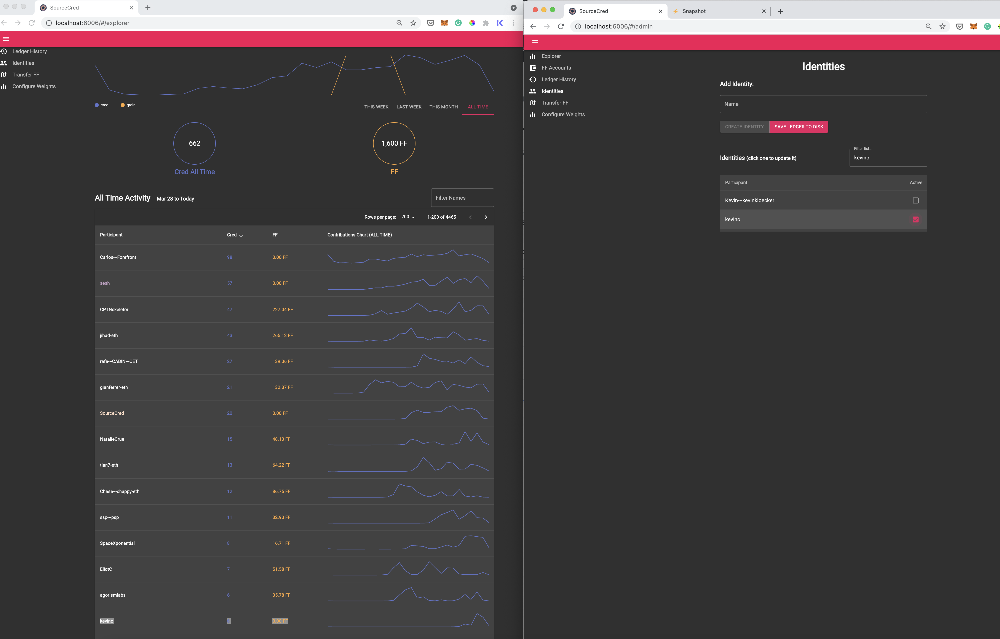

# FF SourceCred 

This repository contains 

## How to setup

```
git clone https://github.com/ffdao/ff-cred.git
cd ff-cred
yarn
cp .env.example .env
```

Update `SOURCECRED_DISCORD_TOKEN` on `.env` (the example credential is not ours)

## How to calculate ff allocations(aka grains) 

1. Fetch the latest cred (takes 5~10 min)

first, create the new branch and run the following command.

```
yarn load
```

Once complete, commit the change.

2. Add new members

Open explorer page `http://localhost:6006/#/explorer` and show "All Time Activity", "Rows per page = 200", and sort by "Dred" desc order.

If there are any participants who have more than 2 cred with no FF, they are newly contributed members. List down all names, and add them at "Identities" tab, search the member, and tick the box. Highly recommend to go through the names with Carlos to exclude these accounts.

- FT/PT/CT/Advisors (eg: Carlos---Forefront, Joey-DeBruin, coopahtroopa) according to [these proposals](https://snapshot.org/#/ffdao.eth/proposal/QmejUFkTFzhWS3McVpYbfX3C4u1cBLSFqqfqysvXe3rrL5)
- bots (eg: seth, SourceCred, FF-BOT)



Once all added, click "Save Ledger to disk", and commit the change.


3. Run grains

```
yarn grain
```

4. Make PR and merge

Example https://github.com/ffdao/ff-cred/pull/11

5. Combine the 4 week worth of distribution into 1 month and give to Carlos

If you save the grain distribution data of each weeek into seperate file, you can run the following script to create the summary. Make sure to remove duplicate as `yarn grain` returns the same data twice for some reason.

```
$node script/summary.js /tmp/sc-0829.txt /tmp/sc-0905.txt /tmp/sc-0912.txt /tmp/sc-0919.txt
name, sc-0829.txt,sc-0905.txt,sc-0912.txt,sc-0919.txt, summary
CPTNskeletor,75.433,103.243,58.505,54.31,291.491
jihad-eth,73.794,77.134,48.236,47.2,246.36399999999998
rafa---CABIN---CET,25.023,49.039,28.977,53.5,156.539
Chase---chappy-eth,34.803,44.352,6.159,11.045,96.35900000000001
ssp---psp,14.403,13.804,27.003,25.281,80.491
linda,29.561,11.753,18.252,3.642,63.208000000000006
SpaceXponential,18.011,13.172,13.346,16.689,61.217999999999996
gianferrer-eth,7.294,20.916,9.191,21.793,59.194
NatalieCrue,2.66,5.166,27.729,18.086,53.641
Coach-Viking--Daniel-,43.055,0,3.591,5.023,51.669
Grendel,22.061,16.088,7.724,3.819,49.69200000000001
tian7-eth,0,6.866,11.715,20.227,38.808
mel-being,14.518,8.646,0,2.726,25.89
whatascoundrel,0,0,21.668,3.741,25.409
sirsu,8.154,5.46,7.617,4.086,25.317
agorismlabs,7.391,5.923,3.102,5.834,22.25
Aureus,0,0,14.632,6.85,21.482
Qhawe,0,0,10.62,9.805,20.424999999999997
milanshrestha-eth,0,0,10.343,9.974,20.317
patey-eth,6.461,6.102,0,3.525,16.088
gabygoldberg,0,0,13.698,2.346,16.044
David--please-DYOR----,0,0,10.537,3.841,14.378
davidphelps,7.632,3.792,0,1.888,13.312
crankin,0,0,4.162,8.413,12.575
Dave----iodave,0,0,9.064,1.627,10.691
bvajresh,0,0,5.393,4.189,9.582
JDM,0,0,1.057,8.45,9.507
Kristofer--Glasstempo-eth-,2.577,2.198,2.474,2.129,9.378
kevinc,0,0,5.314,3.98,9.294
EliotC,0,0,1.97,6.328,8.298
Austin-Robey--Ampled-,0,0.36,0,7.827,8.187
snorky,0,0,2.793,4.764,7.557
one1speed,0,0,5.02,2.077,7.0969999999999995
Bau,4.204,2.863,0,0.027,7.094
Sarmad---greydient,0,0,4.993,1.506,6.4990000000000006
bgar723,2.452,1.816,0,0.939,5.207
jaydee,0,0,3.162,1.35,4.5120000000000005
kcaryths,0,0,0,3.917,3.917
kei,0,0,1.706,1.772,3.4779999999999998
Vooka,0,0,0,2.662,2.662
Dame,0.504,1.298,0,0,1.802
sriram,0,0,0,0.713,0.713
aunyks-eth,0,0,0,0.635,0.635
danconway-eth,0,0,0,0.61,0.61
RantumBits,0,0,0,0.511,0.511
lotusleaf,0,0,0.229,0.22,0.449
idislikebrian,0,0,0,0.098,0.098
ssp,0,0,0,0,0
undefined,0,0,0,0,0
```